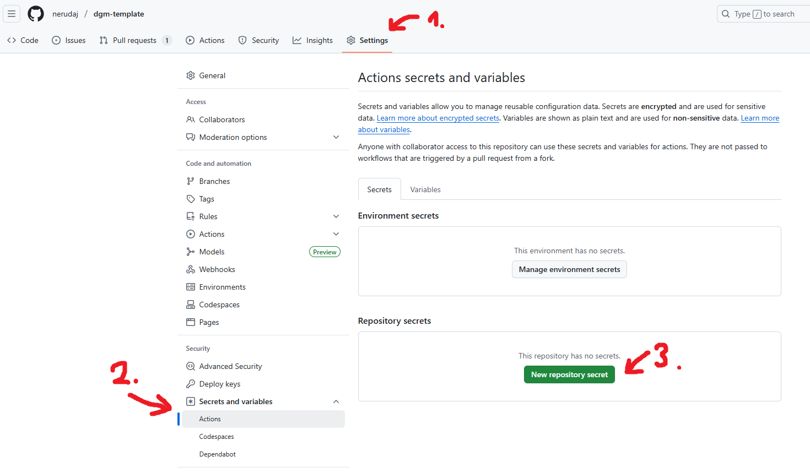

# How to sign Android APKs

The `CI-Android` pipeline produces APKs signed with the default debug key (since the APK itself is the debug build). You don't have to worry about those as they can be installed just fine.

The `Release-Android` pipeline provides the release build which requires you to provide your own signing key. To make this process as straightforward as possible, all you need to do is to put everything into the repository secrets and the rest is handled by the pipeline.

## Step 1: Generate the keystore/key

If you're new to this, you need to create a keystore (a database for keys) with a default key inserted into it. You can do this with the following command:

```sh
keytool -genkeypair -v -keystore android-release-key.jks -keyalg RSA -keysize 2048 -validity 10000 -alias android-release-key
```

Feel free to fine-tune the name of the keystore, the alias, validity and other parameters. This command will prompt you for a password (keystore password) and identification information about yourself that will be embedded into the key. The key will use the same password (signing key password) as the keystore.

> Note: `keytool` is located inside your Java SDK bin folder. If you don't have it in PATH, you'll need to find your installation and run it from there.

## Step 2: Convert keystore into Base64

It is not good idea to keep secrets checked-in into the version control. Therefore, you **must not** commit the keystore file. Instead, convert it into base64-encoded string that will be stored within repository secrets. The release pipeline will then convert that string back into the keystore file and use it.

In powershell, input the following command:

```pwsh
$bytes = [System.IO.File]::ReadAllBytes('path/to/android-release-key.jks')
[Convert]::ToBase64String($bytes)
```

This will print base64-encoded string, copy it somewhere.

## Step 3: Create repository secrets

Navigate to the page on GitHub as denoted on the following image:



In here, create three secrets:

* APK_KEYSTORE_BASE64 - the value is your base64-encoded string
* APK_KEYSTORE_PASSWORD - this is your keystore password
* APK_KEY_ALIAS - the key alias (android-release-key in the example prompt)

That's it! If you've done everything correctly, you should be able to manually trigger the `Release-Android` pipeline and get an APK that can be installed on your phone.

## [Optional] Step 4: Use key with a custom password

If you want to use pre-existing key with a different password than the keystore itself, create an appropriate repository secret. Then, edit `.github/workflows/release-android.yml`. Change the line that spells `APK_SIGNING_KEY_PASSWORD: ${{ secrets.APK_KEYSTORE_PASSWORD }}` to spell: `APK_SIGNING_KEY_PASSWORD: ${{ secrets.<YOUR_SECRET_NAME> }}` where `<YOUR_SECRET_NAME>` is the name of the secret containing your key password.
