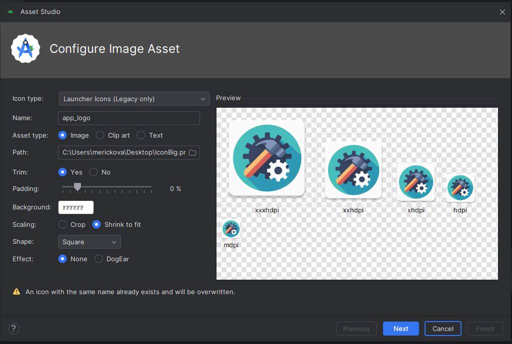

# Application Icon

## Android

The best way to create an application icon for Android is first to prepare your icon as a 512x512 image as we will only scale down from there and also this is the size you need for Google Play store.

Second, boot up your Android Studio with your project, wait until all Gradle-related tasks end, then locate the `res` directory and the `drawable` subdirectory within it, right-click it, New->Image asset.

Set up the dialog as shown on the screen and provide the path to your full icon. Click next and finish. This will generate your icons in the build folder so navigate to the folder in which you've configured CMake, so navigate to: `<build_folder>/app/src/main/res`, rename all `mipmap-*` folders to `drawable-*`, copy them, and paste them into the root of the repo into `android/res`, confirm overwrite files.

## Windows

For Windows, you need to create four different icons and pack them into an .ico file. One option is to use Gimp and edit the prepared file under `assets-private/appicon.xcf`. Once all layers are properly edited, use export to export the file as `assets-private/appicon.ico`. The rest is handled by the build system.
